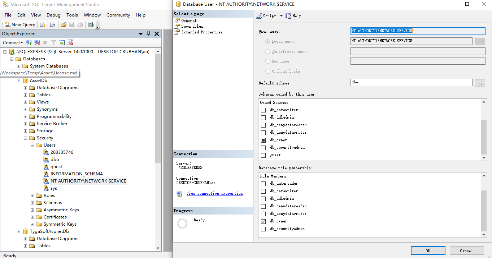
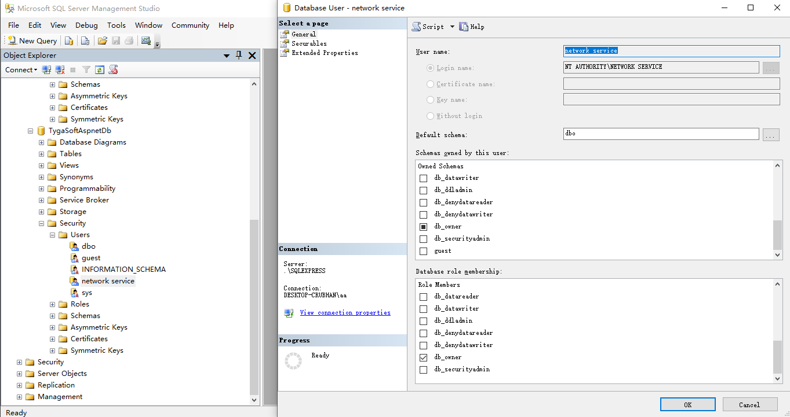
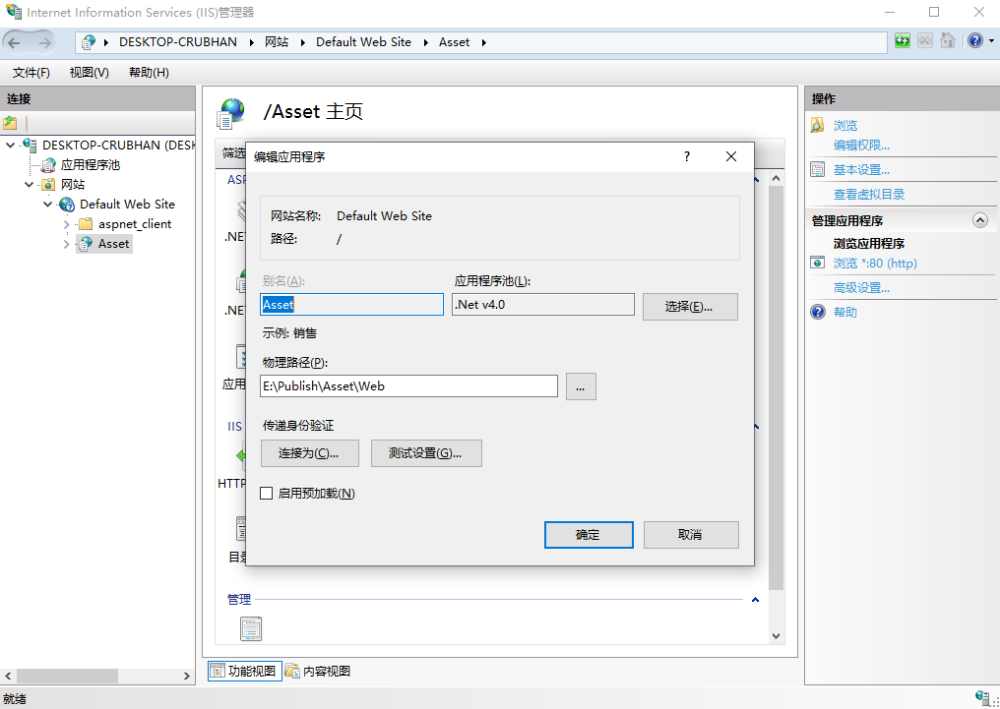
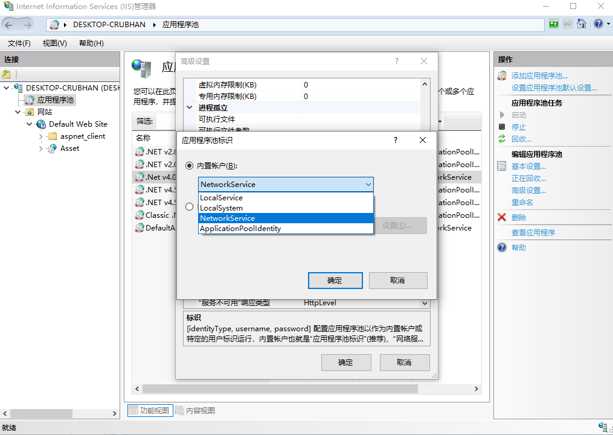
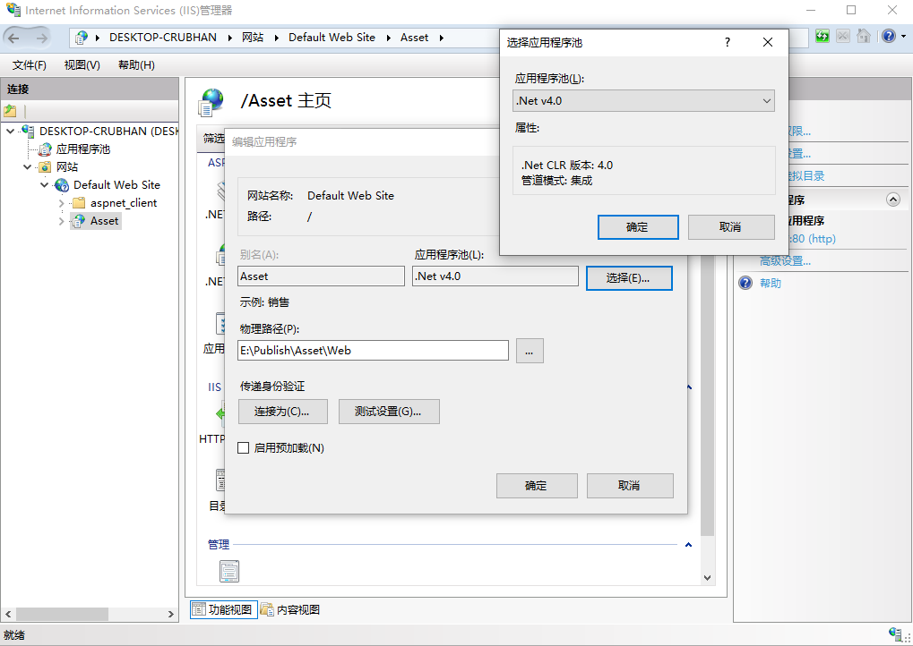

# 使用windows 10部署固资管理Asset

一、数据库安装与配置

1、打开Microsoft SQL Server Management Studio，分别附加TygaSoftAspnetDb、 AssetDb

2、分别在TygaSoftAspnetDb、AssetDb创建用户Network Service,并分配db_owner权限

二、IIS安装与配置

安装IIS时注意，打开或关闭windows功能，.NET Framework4.7 高级服务-WCF服务，需选中HTTP激活。

1、输入inetmgr，打开IIS管理器

2、右键应用程序池-添加应用程序池，名称输入：.NET v4.0，点击“确定”，选中.NET v4.0应用程序池，点击“高级设置”，“标识”-内置账户，选择“NetworkService”，如图：

3、鼠标定位在默认站点，右键-添加应用程序，别名：Asset，应用程序池选择刚刚创建的.NET v4.0，选择物理路径,点击“确定”按钮。值得注意的是：建议在默认站点下部署Asset，且添加应用程序名称必须是“Asset”，若不是在默认站点下部署（如新建站点），则需要添加虚拟目录“Asset”进行部署，否则运行后将无法正常浏览。

至此，打开浏览器，输入：http://localhost/Asset 回车，输入登录账号并登录，即可进入后台管理页。

